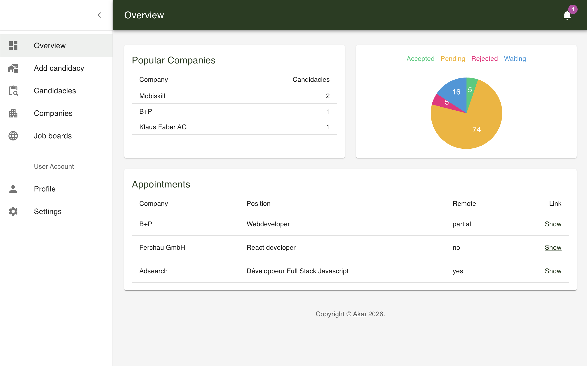
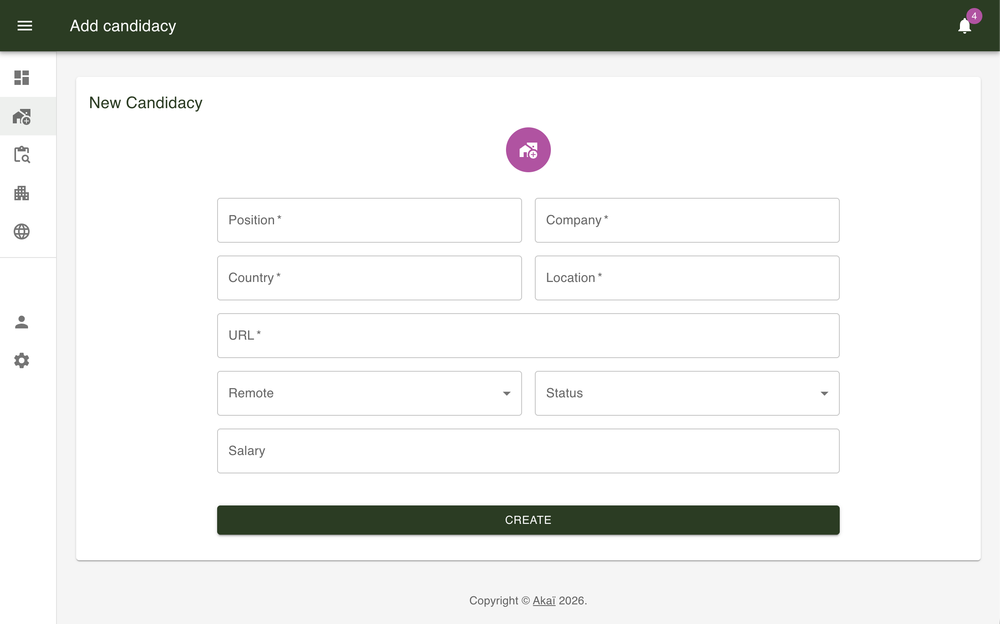
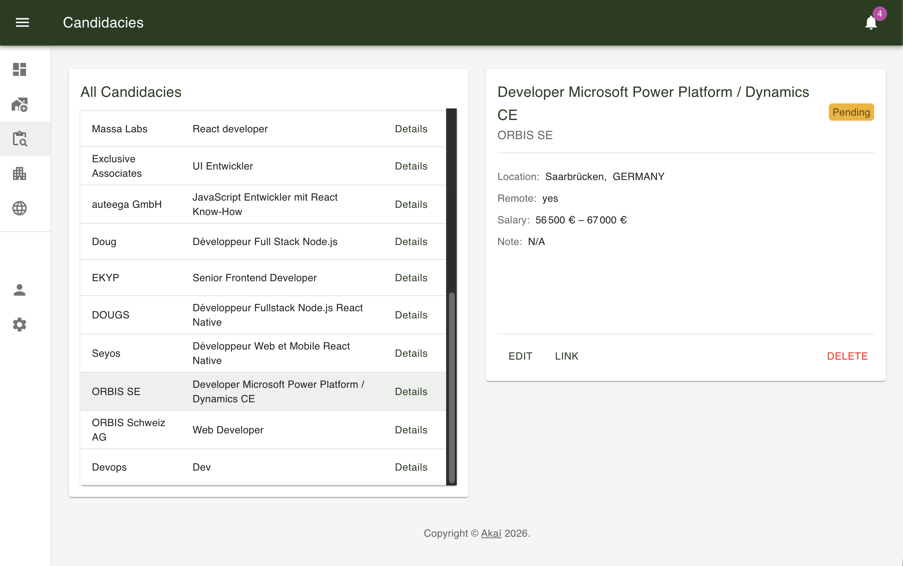
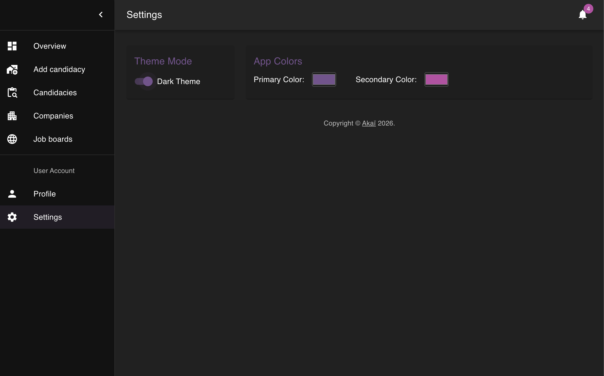

# CandiTask - Appwrite Web App

> 🚧 **Note:** This project is actively developed. New features and structural improvements are being added regularly (see the Roadmap below).

Interactive web app to manage and track job applications, built with React + TypeScript + Vite + Appwrite.

Product goal: deliver a fast, practical, and professional dashboard to centralize candidacies, monitor progress, and improve follow-up quality during job search.

<p align="center">
   
   <br>
   <em>Preview of the CandiTask overview dashboard</em>
</p>

## Demo

- Preview URL: https://monumental-creponne-9d753e.netlify.app/
- Production build powered by Vite

## Key Features

- Email authentication flow with Appwrite (sign up, sign in, session restore, logout)
- Dashboard navigation with responsive MUI AppBar + Drawer tabs
- Full candidacy CRUD (create, list, view details, edit, delete with confirmation dialog)
- Application details edition mode (status, remote mode, salary, notes)
- Real-time overview widgets:
   - Popular companies ranking
   - Appointments list (waiting candidacies)
   - Status distribution chart (custom SVG pie chart)
- Companies aggregation view (country, location, total candidacies)
- Job boards quick-links page for daily sourcing workflow
- User profile view (identity, registration date, quick logout)
- Personalized UI settings (dark/light mode + primary/secondary color pickers)
- User settings persisted in Appwrite database

<p align="center">
   
   <br>
   <em>Preview of the new candidacy form</em>
</p>
<br>
<p align="center">
   
   <br>
   <em>Preview of candidacy details and edit mode</em>
</p>
<br>
<p align="center">
   
   <br>
   <em>Preview of settings and theme customization</em>
</p>

## Tech Stack

- React 18
- TypeScript
- Vite
- Material UI (MUI)
- Appwrite SDK
- @uiball/loaders

## Project Architecture

The codebase is organized by UI and business domains:

- src/components: UI modules (Auth, Dashboard, Overview, Candidacies, Companies, Job Boards, Profile, Settings)
- src/providers: global state with Context API (User, App, Dashboard, Candidacies)
- src/helpers: data transforms and business helpers (status chart, companies, formatting, filtering)
- src/interfaces: typed contracts for providers and domain models
- src/utils: shared constants, enums, and Appwrite client setup

## State Management

- UserProvider: authentication lifecycle, form mode toggle, user session state
- AppProvider: theme mode, color customization, responsive breakpoints, Appwrite settings sync
- DashboardProvider: current tab state, drawer open/close behavior
- CandidaciesProvider: candidacy list, selected candidacy, CRUD operations, companies aggregation

## Data Layer

Data is managed through Appwrite:

- Authentication: Appwrite Account service (email/password + session)
- Candidacies: Appwrite Database collection for user applications
- Settings: Appwrite Database collection for per-user UI preferences

Required environment variables:

- VITE_APPWRITE_API_URL
- VITE_APPWRITE_PROJECT_ID
- VITE_APPWRITE_DATABASE_ID
- VITE_APPWRITE_CANDICACIES_COLLECTION_ID
- VITE_APPWRITE_SETTINGS_COLLECTION_ID

## UX/UI Highlights

- Responsive dashboard UX optimized for desktop and tablet workflows
- Dense but readable data tables for candidacy monitoring
- Detail panel flow for quick edit and status updates
- Theme personalization for comfort during long tracking sessions
- Visual status breakdown with chart and contextual colors

## Expected KPIs

This section is useful for freelance positioning and client discussions.

- +25% to +45% improvement in candidacy tracking consistency
- +15% to +30% increase in follow-up actions on pending/waiting applications
- +20% to +35% reduction in missed interview links or appointments
- +10% to +25% faster weekly review process thanks to centralized dashboard
- <2.5s median page load on standard broadband/devices (frontend target)

Tracking suggestions:

- Number of candidacies created per week
- % candidacies updated at least once after creation
- Waiting-to-interview conversion rate
- Edit activity per candidacy (status/notes updates)
- Recurring usage (weekly active users for personal productivity products)

## Installation

Requirements:

- Node.js 18+
- pnpm or npm

1. Install dependencies:

```bash
pnpm install
```

2. Create an environment file:

```bash
cp .env .env.local
```

Then fill your Appwrite values in .env.local.

3. Start development server:

```bash
pnpm dev
```

Alternative with npm:

```bash
npm install
npm run dev
```

## Available Scripts

With pnpm:

```bash
pnpm dev      # start Vite dev server
pnpm build    # compile TypeScript and build for production
pnpm preview  # preview production build locally
pnpm lint     # run ESLint
```

With npm:

```bash
npm run dev      # start Vite dev server
npm run build    # compile TypeScript and build for production
npm run preview  # preview production build locally
npm run lint     # run ESLint
```

## Project Structure

```text
.
|- public/
|- src/
|  |- components/
|  |  |- Auth/
|  |  |- Candidacies/
|  |  |- Companies/
|  |  |- Dashboard/
|  |  |- Links/
|  |  |- Overview/
|  |  |- Settings/
|  |  |- User/
|  |- helpers/
|  |- interfaces/
|  |- providers/
|  |- utils/
|  |- App.tsx
|  |- main.tsx
|  |- index.css
|- .env
|- package.json
|- tsconfig.json
|- vite.config.ts
```

## Improvement Roadmap

- Add server-side filtering/sorting and pagination for large candidacy volumes
- Add unit tests for helpers/providers and integration tests for main CRUD flows
- Add notifications/reminders for interview follow-ups
- Add import/export (CSV/JSON) for candidacy data portability
- Add multi-language support (FR/EN) for broader adoption

## Freelance Positioning (Malt / Fiverr)

This project demonstrates:

- Ability to design and ship a complete business-oriented dashboard
- Practical Appwrite integration for authentication and data persistence
- Clean modular architecture with typed domain modeling
- Product-driven UX focused on monitoring, actionability, and retention

## Author

Pascal Hector (Akaï)

Freelance Web & Mobile Developer (TypeScript) | React & React Native / Expo / Cordova

This repository is shared as a project showcase for client discussions on freelance platforms.
